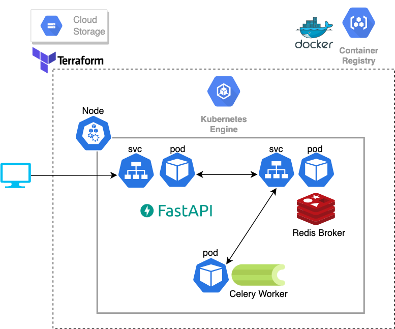

# ml-fastapi-celery
# Features
## Infrastructure Architecture


## Text vectorizer based on BERT
- [TextVectorizer](https://github.com/fyk7/ml-fastapi-celery/blob/master/src/libs/text_vectorizer.py)
- [TextVectorizer test]()
## Fastapi
- [TextVectorize endpoint](https://github.com/fyk7/ml-fastapi-celery/blob/master/src/api/routers/vectorize_text.py)
## Celery(Redis broker)
- [Async prediction worker](https://github.com/fyk7/ml-fastapi-celery/blob/master/src/worker/worker.py)
## Kubernetes
- [Kustomization(to separate local, stg, prd environments)](https://github.com/fyk7/ml-fastapi-celery/blob/master/k8s/overlays/prd/kustomization.yaml)
- Fastapi, Celery, Redis deployments
- Deploy to GCP
## GCP(Terraform)
- [Terraform definition of GKE (minimum configration)](https://github.com/fyk7/ml-fastapi-celery/blob/master/terraform/gke.tf)
## How to use?
```sh
# 1.Docker-compose
$ docker-compose up --build -d
$ docker-compose down

# 2.Kubernetes
# Use docker-compose only for building containers.
$ docker-compose-k8s build
$ kustomize build k8s/overlays/local | kubectl apply -f -
$ kustomize build k8s/overlays/local | kubectl delete -f -
```

## Future Work
- resource, readiness prove, liveness proveの追加及び各種パラメータの追加
- 適切なNodeにPodを配置する
- BERTのパラメータの置き場をpersistent volumeに作成 or gcsに置いて利用時にキャッシュ
- Ingress
- fluented
- Github Actions CI
- Argo CD
- FastapiとTextVectorizerの結合をさらに疎にする

## References
- https://github.com/gitumarkk/kubernetes_django
- https://github.com/GregaVrbancic/fastapi-celery
- https://github.com/katanaml/katana-skipper
- https://kakakakakku.hatenablog.com/entry/2021/08/23/143606
- https://thinkit.co.jp/article/18453?page=0%2C1